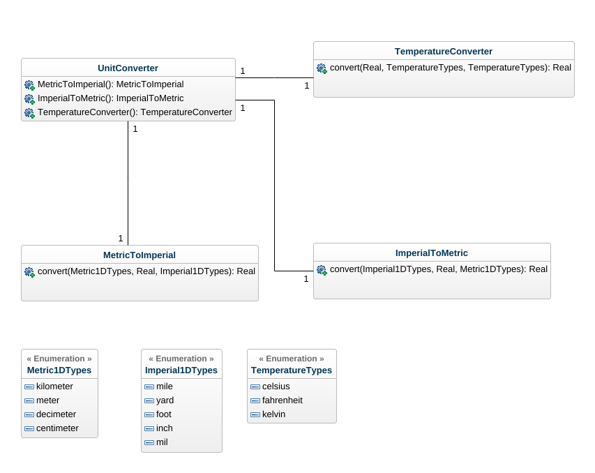

# Unit Converter
###### Author: Chris Johannesson - cj223bc - <info@chrisjohannesson.com>

## Note:
Project in course 1DV610 at Linnaeus University, Kalmar, Sweden

## License 
[ISC](LICENSE) license

**Version:** >= ES6
**Type:** ES module

## Usage:

Start with installing the package into your project
```bash
npm install --save d4m-unit-converter
# or
yarn add d4m-unit-converter
```

A typical usage would be
```bash
# for conversions between metric and imperial measures
import {UnitConverter, Metric1DTypes, Imperial1DTypes} from 'd4m-unit-converter'
const unitconverter = new UnitConverter()
# for metric to imperial conversions
const converter = unitconverter.MetricToImperial
const result = converter.convert(metricType, metricValue, imperialType)
# for imperial to metric conversions
const converter = unitconverter.ImperialToMetric
const result = converter.convert(imperialType, imperialValue, metricType)

# for temperature conversions
import {UnitConverter, TemperatureTypes}
const unitconverter = new UnitCOnverter()
const converter = unitconverter.TemperatureConverter
const result = converter.convert(fromValue, fromType, toType)
```
Create an instance of the UnitConverter and from there you can chose which type of converter you want to use as illustrated above.

[Test app](https://github.com/LNU-PUB/610_l2_test_app)

## Class Diagram

