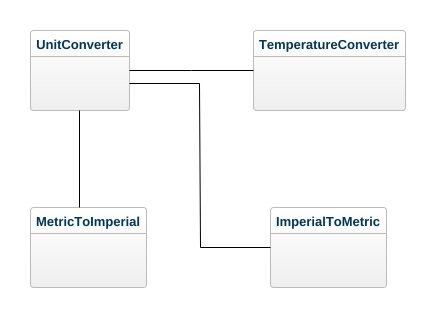

<h1>L2 - Module</h1>
<h2>UnitConverter</h2>

### Description
This module will convert between the metric and imperial unit systems and temperature conversions between Kelvin, Centigrade, and Fahrenheit.

### Domain Model

## Reflection

Reading up on the npm modules took some time and I had a hard time to get it all to work. I set it up a CI on github actions that will transpile and upload the module to the npm repository on every push if it passes.

It is not a very difficult project per se but it is a lot of code to write and in some parts github copilot has been helpful but most of the time it has been good old fashion copy & paste that did the trick.

The following automated tests where setup and run.
[Test Run](./test.log.md)

## Meaningful Names

| Name | Explanation | Reflection and rules from CC |
|:-----|:--------------|:------------------------------|
| **UnitConverter** | The main object that is the access point to the functionality| The name is short and actually says what it is about. It's a noun and it adheres to the following rules: **Use Intention-Revealing Names**, **Use Pronounceable Names**, and **Avoid Disinformation**
| **MetricToImperial** | Class handling metric to imperial conversions | The name reveals quite well what you can expect from the class and it adheres to the **Pronounceable Names** and maybe even more **Don't be Cute** and **Add meaningful Context** |
|**ImperialToMetric** | Class that is handling imperial to metric conversions | Also adheres well to **Add Meaningful Context**, **Intention-Revealing Names**, and **Avoid Disinformation** |
| **TemperatureConverter** | The class that handles the conversions between Celsius, Fahrenheit, and Kelvin | Also this name is quite clear about what you can expect from this class. It adheres to **Searchable Names** as well as **Solution Domain Names** and the **Class Names** rule since it is a noun phrase. |
| **convert** | convert is the main entry-point into each of the above three classes that handles conversions. | It's a verb as it is a function so it adheres to **Method Names** its functionality also adheres to the **Single Responsibility Principle** even if that comes later in the book and it **Avoids Encoding** |

The content in chapter two as in the whole book itself is quite old by now. But it is a good reference book when it comes to writing good and clean code. Much of the content feels quite obvious like names that reveals the intention of the class or that says what the method is actually doing. I learned a while back that you should name all your variables and classes so that you don't have to add any comments. While I think it is a good practice in general I can also see the usefulness of some comments. Unfortunately we were forced to write comments on everything in earlier JavaScript courses and using the same linting rules here produces a lot of comments that I personally think is redundant.

Having said all that it is still interesting and very relevant when it comes to naming conventions and how important it is to think about good names for functions and variables. It makes the development work much easier too if you can read the code and it more or less tells you a story.  I just reviewed some old code from 2003 and I'm surprised to some extent I did already then adhere to some of the teachings in this book even though the book is from 2009. So what relevance does that have? Simply put, naming variables and methods clearly makes it easier to understand their intended functions. Properly naming variables, methods and classes is important and as code bases grow it becomes ever more important, because I think most people are like me and don't like to sit and read a long complicated description of a package to be able to use it. I believe it should be self-explanatory and names should be relevant and descriptive so you don't have to read a manual just the names in a properly organized interface. That is the thinking behind that all the operating classes i.e. MetricToImperial, ImperialToMetric, and TemperatureConverter all have one entry point the method *convert()*. I realize that there should have been some more consistency in where things were placed as arguments in that function since it differs a bit between the convert method in the TemperatureConverter and the other two classes. I should have decided on one order e.g. (numeric value, from type, to type) as in the TemperatureConverter class instead of what the other two classes that has the argument order (from type, numeric value, to type). The code also do not adhere to the DRY principle. There are a few improvements available there to do especially when it comes to the MetricToImperial class. But that will be a later concern. For now it works and the code is reasonably stable depending on how it's used. Neither does it take into account the different decimal separators, which could be an improvement in the future.

## Functions

Just realized that I have commented on this above to some extent. But that doesn't mean that we can't continue with functions or methods here. I just remembered something that I read many moons ago. Can't remember where I got this from but at some point in time I think that people defined functions as methods that returned some value of some sort and if it didn't it was called a method. I might remember wrong but somewhere in the back of my mind there is a memory of something like that.